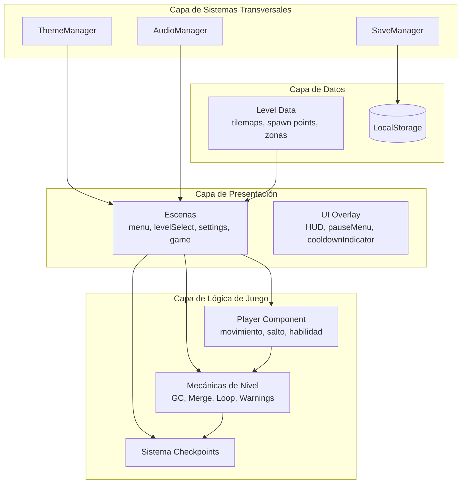
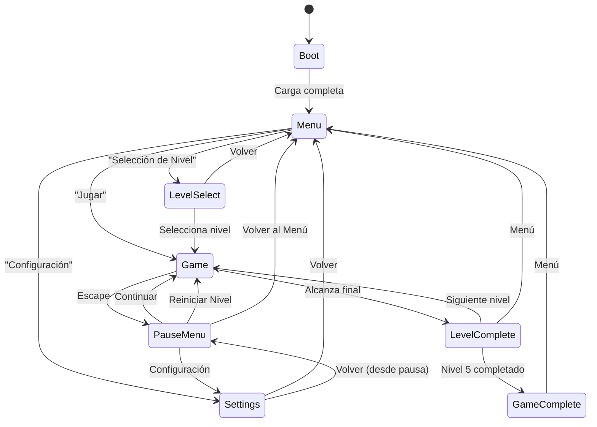
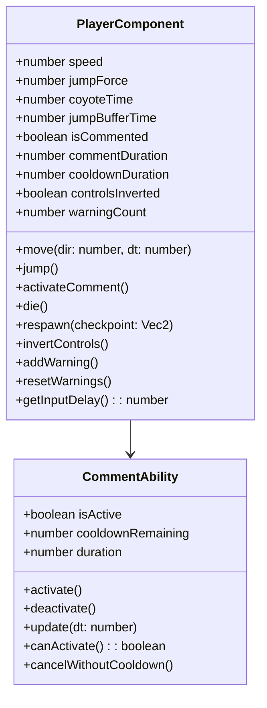
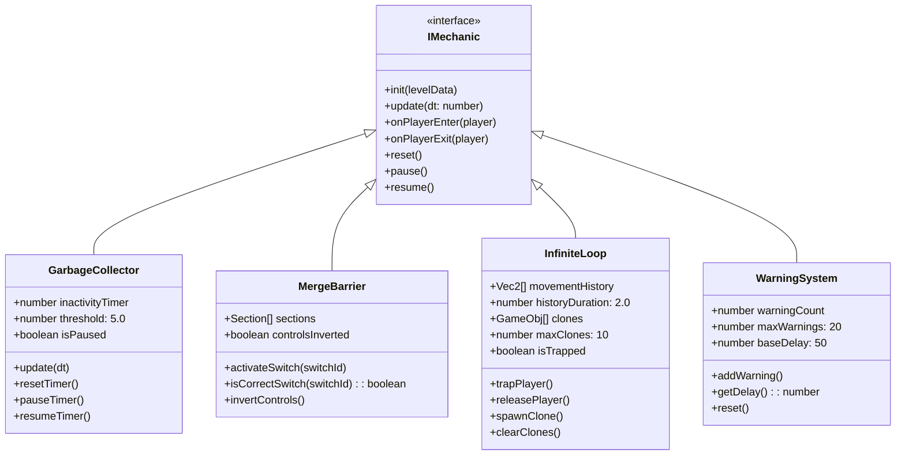
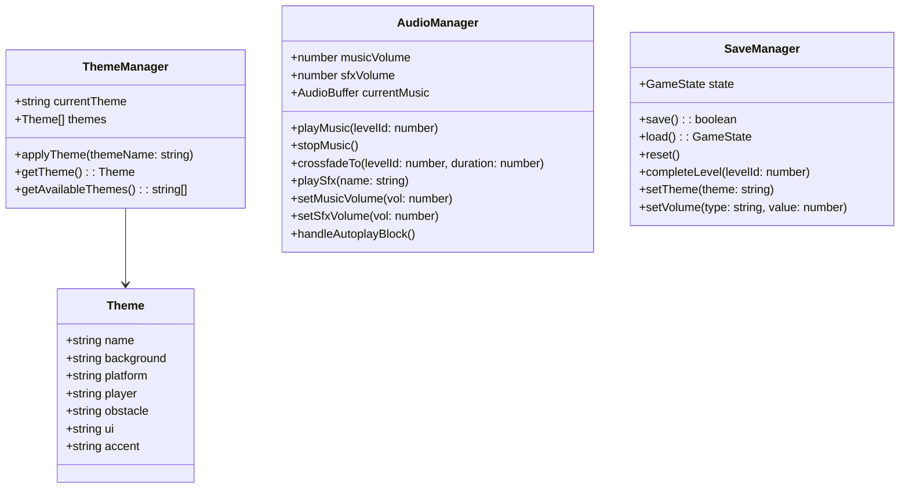
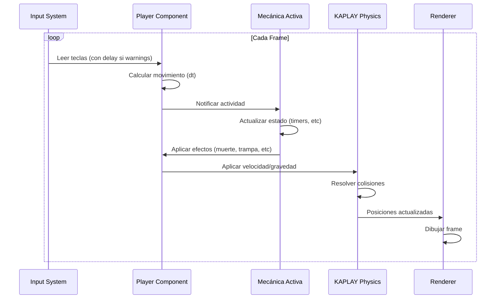
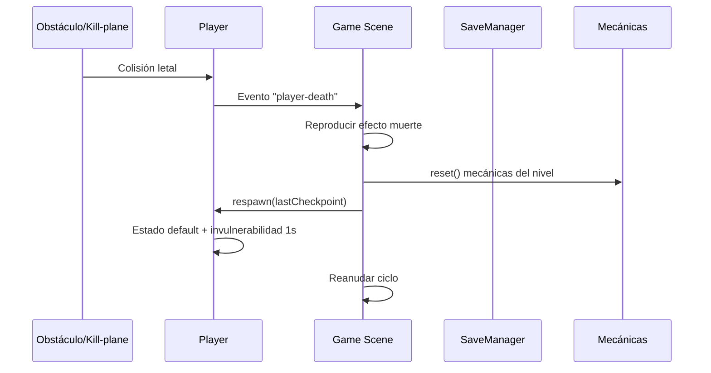
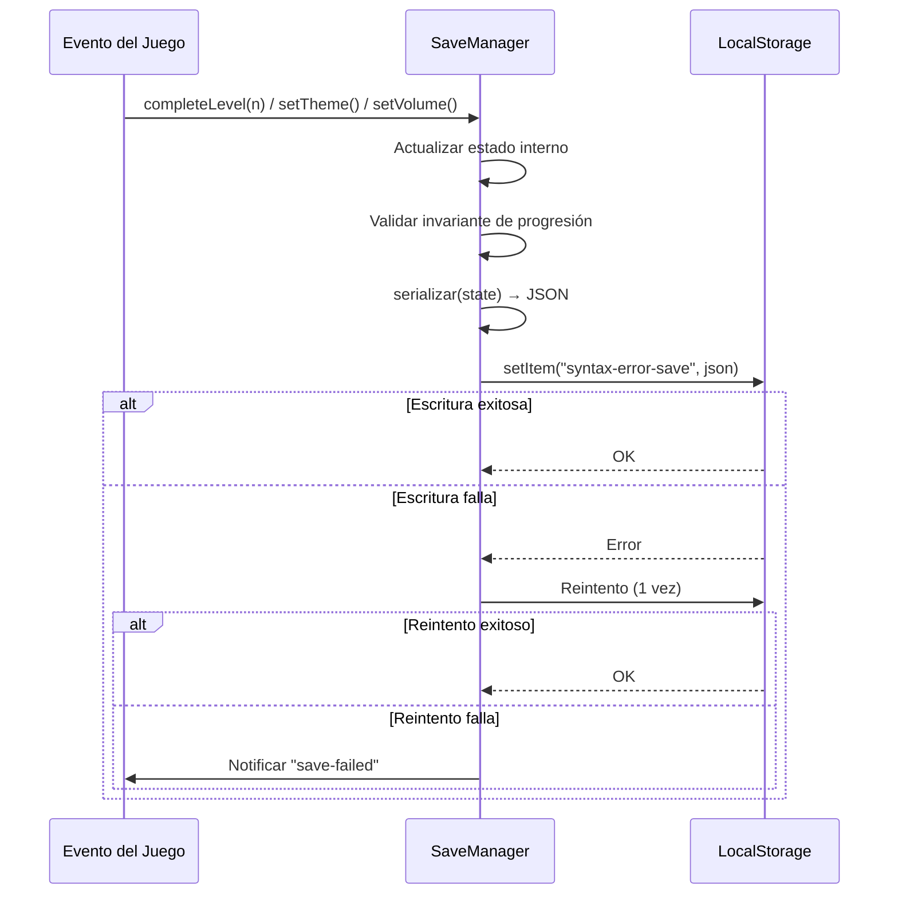
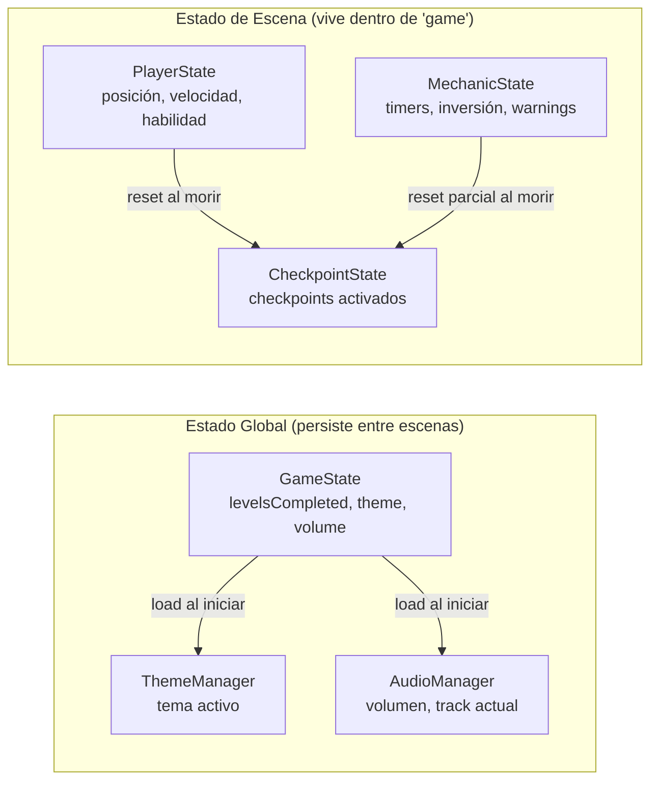

# Documento de Diseño — Syntax Error

## Resumen

Este documento describe la arquitectura y diseño técnico de "Syntax Error", un plataformas 2D troll con temática de programación construido con KAPLAY.js y empaquetado con Vite. El jugador controla un personaje `;` (punto y coma) a través de 5 niveles con mecánicas inspiradas en dolores comunes del desarrollo de software.

### Decisiones Técnicas Clave

| Decisión | Elección | Justificación |
|----------|----------|---------------|
| Motor | KAPLAY.js | API declarativa, sistema de componentes integrado, manejo de escenas, física y colisiones out-of-the-box |
| Bundler | Vite | Hot reload rápido, soporte nativo ESM, scaffold oficial via `npx create-kaplay` |
| Plataforma | Web (estática) | Sin backend, deploy simple, accesible desde cualquier navegador |
| Persistencia | LocalStorage | Suficiente para datos ligeros de progreso, sin dependencias externas |
| Lenguaje | JavaScript (ES Modules) | Ecosistema nativo de KAPLAY, sin overhead de compilación |

---

## Arquitectura

### Diagrama de Arquitectura General



### Diagrama de Flujo de Escenas



### Patrón de Comunicación

El juego utiliza el patrón **Event-Driven** de KAPLAY basado en:
- **`on()`/`trigger()`**: Eventos personalizados entre componentes
- **`onCollide()`/`onCollideUpdate()`**: Detección de colisiones
- **Componentes custom**: Estado encapsulado con métodos expuestos

---

## Componentes e Interfaces

### Componente Player



### Interfaces de Mecánicas



### Interfaces de Sistemas Transversales



---

## Flujo de Datos

### Ciclo de Juego Principal



### Flujo de Muerte y Reaparición



### Flujo de Persistencia



---

## Modelos de Datos

### Estado del Juego (GameState)

```javascript
/**
 * @typedef {Object} GameState
 * @property {boolean[]} levelsCompleted - Array de 5 booleanos, progresión secuencial
 * @property {string} currentTheme - Nombre del tema activo
 * @property {{music: number, sfx: number}} audioVolume - Volúmenes [0.0, 1.0]
 * @property {string[]} memoryAddresses - Direcciones recolectadas (futuro)
 */
const DEFAULT_STATE = {
  levelsCompleted: [false, false, false, false, false],
  currentTheme: "terminal",
  audioVolume: { music: 0.5, sfx: 0.7 },
  memoryAddresses: []
};
```

### Estructura de Nivel (LevelData)

```javascript
/**
 * @typedef {Object} LevelData
 * @property {number} id - Identificador del nivel (1-5)
 * @property {string} name - Nombre del nivel
 * @property {string[]} tilemap - Array de strings representando el tilemap
 * @property {Object} tileConfig - Configuración de tiles (qué char = qué objeto)
 * @property {Vec2} playerSpawn - Posición inicial del jugador
 * @property {Vec2[]} checkpoints - Posiciones de los checkpoints
 * @property {MechanicConfig[]} mechanics - Mecánicas activas en el nivel
 * @property {string} musicTrack - Nombre del track de audio
 */

/**
 * @typedef {Object} MechanicConfig
 * @property {string} type - "garbageCollector" | "mergeBarrier" | "infiniteLoop" | "warningSystem"
 * @property {Object} params - Parámetros específicos de la mecánica
 * @property {Zone[]} zones - Zonas de activación (rectángulos)
 */

/**
 * @typedef {Object} CheckpointData
 * @property {Vec2} position - Posición del checkpoint
 * @property {boolean} activated - Si ha sido activado
 */
```

### Configuración de Temas

```javascript
/**
 * @typedef {Object} ThemeConfig
 * @property {string} id - Identificador único
 * @property {string} name - Nombre para mostrar
 * @property {Object} colors
 * @property {string} colors.background - Color de fondo
 * @property {string} colors.platform - Color de plataformas
 * @property {string} colors.player - Color del jugador
 * @property {string} colors.danger - Color de obstáculos
 * @property {string} colors.ui - Color de interfaz
 * @property {string} colors.accent - Color de acento
 * @property {string} colors.text - Color de texto
 */
const THEMES = {
  terminal: { name: "Terminal Retro", colors: { background: "#0d1117", platform: "#30363d", player: "#58a6ff", danger: "#f85149", ui: "#c9d1d9", accent: "#3fb950", text: "#f0f6fc" }},
  dark:     { name: "IDE Dark",      colors: { background: "#1e1e1e", platform: "#2d2d2d", player: "#569cd6", danger: "#f44747", ui: "#d4d4d4", accent: "#4ec9b0", text: "#ffffff" }},
  light:    { name: "IDE Light",     colors: { background: "#ffffff", platform: "#e0e0e0", player: "#0000ff", danger: "#cd3131", ui: "#333333", accent: "#008000", text: "#000000" }},
  blueprint:{ name: "Blueprint",     colors: { background: "#1a237e", platform: "#3949ab", player: "#ffffff", danger: "#ff5252", ui: "#bbdefb", accent: "#69f0ae", text: "#e8eaf6" }},
  bsod:     { name: "BSOD",         colors: { background: "#0000aa", platform: "#0000dd", player: "#ffffff", danger: "#ff0000", ui: "#aaaaaa", accent: "#55ff55", text: "#ffffff" }}
};
```

### Estado del Jugador en Ejecución

```javascript
/**
 * @typedef {Object} PlayerState
 * @property {Vec2} position - Posición actual
 * @property {Vec2} velocity - Velocidad actual
 * @property {boolean} isGrounded - Si está en el suelo
 * @property {boolean} isCommented - Si está en estado "comentado"
 * @property {number} commentTimer - Tiempo restante de estado comentado
 * @property {number} cooldownTimer - Tiempo restante de cooldown
 * @property {boolean} controlsInverted - Si los controles están invertidos
 * @property {number} warningCount - Warnings acumulados
 * @property {number} coyoteTimer - Tiempo restante de coyote time
 * @property {number} jumpBufferTimer - Tiempo restante de jump buffer
 * @property {boolean} isInvulnerable - Si está en periodo de invulnerabilidad post-respawn
 * @property {number} invulnerabilityTimer - Tiempo restante de invulnerabilidad
 * @property {Vec2} lastCheckpoint - Posición del último checkpoint activado
 */
```

---

## Diseño de Niveles

### Estructura General

Cada nivel se define como un tilemap de caracteres donde cada carácter mapea a un componente KAPLAY:

```javascript
// Ejemplo simplificado de tileConfig
const TILE_SYMBOLS = {
  "=": () => [sprite("platform"), area(), body({ isStatic: true }), "platform"],
  "@": () => [sprite("player"), area(), body(), "player"],
  "X": () => [sprite("spike"), area(), "lethal"],
  "C": () => [sprite("checkpoint"), area(), "checkpoint"],
  "G": () => [sprite("gc-robot"), area(), "gc-zone"],
  "M": () => [sprite("merge-wall"), area(), body({ isStatic: true }), "merge-barrier"],
  "S": () => [sprite("switch"), area(), "merge-switch"],
  "L": () => [sprite("loop-zone"), area(), "loop-zone"],
  "W": () => [sprite("warning"), area(), "warning-sign"],
};
```

### Niveles y sus Mecánicas

| Nivel | Nombre | Mecánica Principal | Elementos Clave |
|-------|--------|-------------------|-----------------|
| 1 | Garbage Collector | Recolector_Basura | Plataformas en movimiento, timer de inactividad |
| 2 | Merge Conflict | Barrera_Merge | Muros de conflicto, switches (1 correcto, 2-3 incorrectos) |
| 3 | Stack Overflow | Bucle_Infinito | Zonas de bucle, clones fantasma |
| 4 | Warning Fatigue | Sistema_Warnings | Señales ⚠️ distribuidas, retardo de input progresivo |
| 5 | Production | Todas | Combinación de todas las mecánicas |

---

## Gestión de Estado

### Estado Global vs Estado de Escena



### Reglas de Reset

| Evento | PlayerState | Mecánicas | Checkpoints |
|--------|-------------|-----------|-------------|
| Muerte | Reset a default checkpoint | Timer GC → 0, Warnings → 0, Clones → eliminados, Inversión → persiste | Sin cambio |
| Reiniciar Nivel | Reset a spawn | Todo reset | Todo desactivado |
| Completar Nivel | N/A | Todo reset | N/A |
| Pausa | Congelar | Congelar timers | Sin cambio |

---

## Propiedades de Correctitud

*Una propiedad es una característica o comportamiento que debe mantenerse verdadero en todas las ejecuciones válidas de un sistema — esencialmente, una declaración formal sobre lo que el sistema debe hacer. Las propiedades sirven como puente entre especificaciones legibles por humanos y garantías de correctitud verificables por máquina.*

### Property 1: Round-Trip de Serialización del Estado

*Para todo* estado válido del juego (GameState), serializar con `SaveManager.serialize()` y luego deserializar con `SaveManager.deserialize()` SHALL producir un estado con igualdad profunda en todos los campos respecto al original.

**Validates: Requirements 12.5, 12.7**

### Property 2: Invariante de Progresión Secuencial

*Para todo* estado de `levelsCompleted` válido, si `levelsCompleted[i]` es `true`, entonces `levelsCompleted[j]` para todo `j < i` SHALL ser también `true`.

**Validates: Requirements 12.2, 14.2**

### Property 3: Fórmula Monotónica de Retardo de Warnings

*Para todo* N >= 0 y M > N (donde M <= 20), el retardo calculado `t_base * (1 + 0.15 * M)` SHALL ser estrictamente mayor que `t_base * (1 + 0.15 * N)`.

**Validates: Requirements 8.2**

### Property 4: Coyote Time como Ventana Temporal

*Para todo* tiempo `t` transcurrido desde que el jugador abandonó una plataforma, si `t < 80ms` y el jugador no ha saltado, el sistema SHALL permitir ejecutar un salto; si `t >= 80ms`, el sistema SHALL rechazar el salto.

**Validates: Requirements 2.3, 2.5**

### Property 5: Inmunidad durante Estado Comentado

*Para toda* colisión entre el jugador en estado "comentado" y un obstáculo lógico (GC, Bucle, Warning), el sistema SHALL ignorar la colisión sin aplicar efecto alguno al jugador.

**Validates: Requirements 3.3, 5.4, 7.4, 8.4**

### Property 6: Idempotencia de Inversión de Controles

*Para toda* secuencia de activaciones de switches incorrectos en el Nivel 2, el estado de inversión de controles SHALL ser equivalente al resultado de una única activación incorrecta (la inversión no se acumula ni se cancela con activaciones adicionales).

**Validates: Requirements 6.3, 6.4**

### Property 7: Reset de Estado al Reaparecer

*Para todo* estado del jugador al momento de morir, tras la reaparición el sistema SHALL producir un estado donde: posición = posición del checkpoint, velocidad = (0,0), cooldown = disponible, warnings = 0, y el estado "comentado" = inactivo.

**Validates: Requirements 4.1, 4.3, 3.9**

### Property 8: Límite Máximo de Warnings

*Para toda* secuencia de colisiones con señales ⚠️, el contador de warnings SHALL nunca exceder 20, y una vez alcanzado 20, colisiones adicionales SHALL no incrementar el valor.

**Validates: Requirements 8.6**

### Property 9: Reinicio de Timer por Actividad

*Para toda* secuencia de eventos donde el jugador presiona una tecla de movimiento con un tiempo de inactividad acumulado `t` (donde `t < 5s`), el timer de inactividad del Recolector_Basura SHALL reiniciarse a 0.

**Validates: Requirements 5.1, 5.2**

### Property 10: Validación de Datos Inválidos en Carga

*Para todo* valor almacenado en LocalStorage que no sea JSON parseable o no cumpla la estructura esperada (campos faltantes, tipos incorrectos, tema inválido), el SaveManager SHALL producir el estado por defecto sin lanzar excepciones.

**Validates: Requirements 12.4, 10.6**

### Property 11: Volumen dentro de Rango Válido

*Para todo* valor de volumen establecido (música o SFX), el valor almacenado y aplicado SHALL estar en el rango [0.0, 1.0] redondeado al incremento más cercano de 0.1.

**Validates: Requirements 11.3**

### Property 12: Movimiento Independiente del Frame Rate

*Para todo* delta time `dt` positivo y dirección de movimiento activa, la distancia recorrida por el jugador SHALL ser igual a `speed * dt` (±1px de tolerancia por redondeo), independientemente del valor absoluto de `dt`.

**Validates: Requirements 1.1, 1.2, 1.6**

---

## Manejo de Errores

### Estrategia por Capa

| Capa | Tipo de Error | Estrategia |
|------|---------------|-----------|
| Persistencia | LocalStorage lleno/inaccesible | Reintentar 1 vez, notificar al usuario si falla, continuar sin guardar |
| Persistencia | Datos corruptos/inválidos | Inicializar con defaults, no mostrar error |
| Audio | Autoplay bloqueado | Esperar primera interacción, reanudar silenciosamente |
| Audio | Recurso no cargado | Continuar sin ese audio, log interno |
| Renderizado | Asset no encontrado | Usar placeholder de color sólido |
| Mecánicas | Estado inconsistente | Reset al estado por defecto del checkpoint |

### Principios

1. **Nunca interrumpir la sesión activa**: Los errores de persistencia o audio no deben detener el juego.
2. **Fail-safe a defaults**: Ante datos corruptos, siempre usar estado inicial válido.
3. **Feedback sin alarma**: Notificaciones sutiles para errores de guardado; sin popups modales.
4. **Invariantes protegidos**: Si un estado viola los invariantes (progresión no secuencial), corregir silenciosamente.

---

## Estrategia de Testing

### Tests Unitarios (Example-Based)

Cubren escenarios específicos y edge cases:

- **SaveManager**: Serialización/deserialización con datos específicos, manejo de LocalStorage inaccesible, datos corruptos
- **Mecánicas**: Activación de switches correctos/incorrectos, entrada/salida de zonas de bucle, stack overflow a 10 clones
- **Navegación**: Transiciones de escena, menú de pausa congela lógica, desbloqueo de niveles
- **Configuración**: Cambio de tema se aplica visualmente, volumen se persiste

### Tests de Propiedades (Property-Based)

Se utilizará **fast-check** como librería de property-based testing.

Cada propiedad del documento se implementará como un test independiente con mínimo 100 iteraciones. Las propiedades son especialmente valiosas aquí porque:

- El sistema de guardado maneja datos arbitrarios → round-trip testing
- El cálculo de retardo de warnings tiene una fórmula matemática → metamorphic testing  
- Las mecánicas del jugador tienen invariantes que deben mantenerse en todo frame → invariant testing
- El estado del juego tiene restricciones estructurales → structural invariant testing

**Configuración de Property Tests:**
- Librería: `fast-check`
- Mínimo 100 iteraciones por propiedad
- Tag format: **Feature: syntax-error, Property {N}: {descripción}**

**Ejemplo de test taggeado:**
```javascript
// Feature: syntax-error, Property 1: Round-Trip de Serialización del Estado
fc.assert(fc.property(
  gameStateArbitrary,
  (state) => {
    const result = deserialize(serialize(state));
    expect(result).toEqual(state);
  }
), { numRuns: 100 });
```

### Tests de Integración

Cubren la interacción entre sistemas:

- **Flujo completo de nivel**: Iniciar nivel → activar checkpoint → morir → reaparecer en checkpoint
- **Persistencia end-to-end**: Completar nivel → verificar LocalStorage → reiniciar juego → verificar carga
- **Audio + Escenas**: Cambio de nivel produce crossfade correcto
- **Tema + Juego**: Cambiar tema mid-level no afecta posición/estado del jugador

### Prioridad de Testing

1. **Alta**: Propiedades de correctitud (round-trip, invariantes, fórmulas)
2. **Alta**: Lógica de mecánicas (GC timer, inversión, warnings)
3. **Media**: Sistema de checkpoints y reaparición
4. **Media**: Persistencia y validación de datos
5. **Baja**: Transiciones de UI y feedback visual
