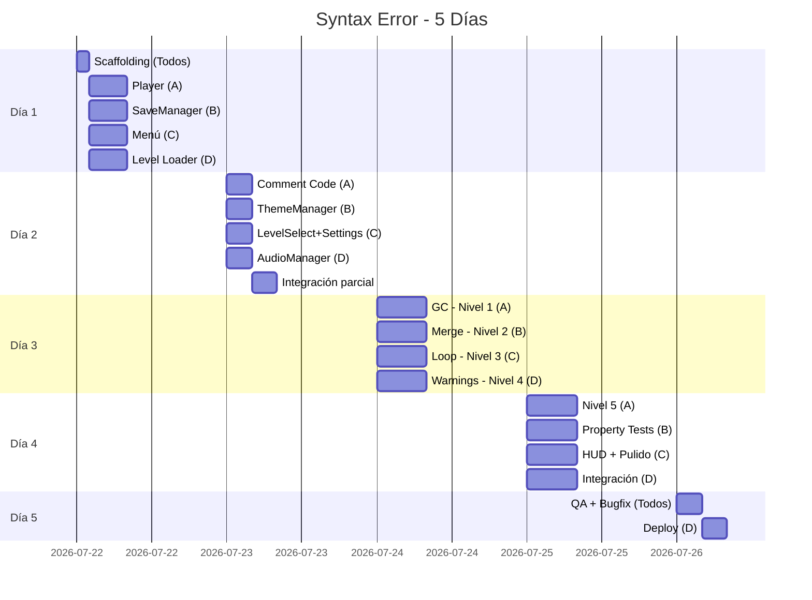

# Plan de Trabajo — Syntax Error (4 miembros, 5 días)

## Equipo

| ID | Rol Principal | Especialidad |
|----|---------------|--------------|
| **A** | Gameplay Core | Player, habilidad, mecánicas complejas |
| **B** | Sistemas & Data | Persistencia, temas, tests |
| **C** | UI & Escenas | Menús, navegación, HUD, pulido visual |
| **D** | Infraestructura & Niveles | Audio, level loader, tilemaps, deploy |

---

## Día 1 — Fundamentos y Core

### Mañana (todos juntos, ~1h)

| Todos | Tarea 1.1: Scaffolding |
|-------|------------------------|
| Ejecutar `npx create-kaplay syntax-error` |
| Crear estructura de directorios |
| Configurar Vite, verificar `npm run dev` |
| Push a `main`, todos clonan |

### Resto del Día 1

| Miembro | Tarea | Archivos | Entregable |
|---------|-------|----------|------------|
| **A** | 2.1: Player + movimiento + salto | `src/components/player.js`, `src/constants.js` | Personaje se mueve, salta con coyote time y jump buffer en escena de prueba |
| **B** | 6.1: SaveManager | `src/systems/saveManager.js` | Guardar/cargar estado en LocalStorage, manejo de datos corruptos |
| **C** | 4.1: Menú Principal | `src/scenes/menu.js` | Menú con 3 opciones navegables por teclado |
| **D** | 9.1: Level Loader + tileConfig | `src/levels/levelLoader.js`, `src/levels/tileConfig.js`, `src/scenes/game.js` | Función que parsea tilemaps y genera objetos KAPLAY |

### Merge de Día 1

```
Branches: feat/player, feat/save-manager, feat/menu, feat/level-loader
→ Merge a develop al final del día
```

### Criterio de avance Día 1
- [ ] Player se mueve y salta en escena de prueba
- [ ] SaveManager serializa/deserializa correctamente
- [ ] Menú principal navega entre opciones
- [ ] Level Loader carga un tilemap de prueba

---

## Día 2 — Sistemas Completos y Escenas

| Miembro | Tarea | Archivos | Entregable |
|---------|-------|----------|------------|
| **A** | 3.1: Habilidad Comment Code | `src/components/commentAbility.js` | Habilidad funciona: 0.5s inmune, cooldown 2s, visual `// ;` |
| **B** | 5.1: ThemeManager (5 temas) | `src/systems/themeManager.js` | Los 5 temas se aplican a elementos visibles, integra con SaveManager |
| **C** | 4.2 + 4.3: Level Select + Settings | `src/scenes/levelSelect.js`, `src/scenes/settings.js` | Pantalla de niveles con estados, pantalla de config con sliders |
| **D** | 7.1: AudioManager + 4.4 parcial (muerte/respawn) | `src/systems/audioManager.js` | SFX placeholder, música loop, crossfade, manejo autoplay |

### Tarde — Integración de Día 2

| Miembro | Extra |
|---------|-------|
| **A** | Integrar player con game scene de D (Día 1) |
| **B** | Conectar ThemeManager con Settings de C y SaveManager |
| **C** | 4.4: Menú de pausa + sistema de muerte/reaparición |
| **D** | Conectar AudioManager con Settings de C y SaveManager de B |

### Merge de Día 2

```
Branches: feat/comment-ability, feat/themes, feat/scenes-complete, feat/audio
→ Merge a develop
```

### Criterio de avance Día 2
- [ ] Habilidad Comment Code funcional con cooldown visual
- [ ] 5 temas aplicables desde Settings y persisten en LocalStorage
- [ ] Flujo completo: Menú → Level Select → Game → Pausa → Menú
- [ ] Audio con placeholders funciona, crossfade al cambiar nivel
- [ ] Sistema de muerte/reaparición con invulnerabilidad 1s

---

## Día 3 — Mecánicas de Niveles (Paralelo Total)

| Miembro | Tarea | Archivos | Entregable |
|---------|-------|----------|------------|
| **A** | 10.1: Garbage Collector + level1 | `src/mechanics/garbageCollector.js`, `src/levels/level1.js` | Timer 5s, robot se acerca, mata si idle, pausa con Comment Code |
| **B** | 11.1: Merge Barrier + level2 | `src/mechanics/mergeBarrier.js`, `src/levels/level2.js` | Muros con switches, inversión permanente, 3+ secciones |
| **C** | 12.1: Bucle Infinito + level3 | `src/mechanics/infiniteLoop.js`, `src/levels/level3.js` | Zonas de bucle, clones fantasma, RangeError, teleport a inicio |
| **D** | 13.1: Warnings + level4 | `src/mechanics/warningSystem.js`, `src/levels/level4.js` | Señales ⚠️, retardo acumulativo, cap 20, contador en UI |

### Interfaz común (todos respetan)

```javascript
// Cada mecánica exporta:
export function createMechanic(levelData) {
  return {
    init(player, scene) {},    // Inicializar
    update(dt) {},             // Cada frame
    onPlayerEnter(player) {},  // Jugador entra en zona
    onPlayerExit(player) {},   // Jugador sale de zona
    reset() {},                // Reset al morir
    pause() {},                // Pausar timers
    resume() {}                // Reanudar timers
  };
}
```

### Merge de Día 3

```
Branches: feat/mechanic-gc, feat/mechanic-merge, feat/mechanic-loop, feat/mechanic-warnings
→ Merge a develop (sin conflictos — archivos distintos)
```

### Criterio de avance Día 3
- [ ] Nivel 1 jugable con Garbage Collector activo
- [ ] Nivel 2 jugable con switches y muros funcionales
- [ ] Nivel 3 jugable con bucles y clones
- [ ] Nivel 4 jugable con warnings y input lag
- [ ] Todas las mecánicas respetan Comment Code (inmunidad)

---

## Día 4 — Nivel 5, Pulido e Integración

| Miembro | Tarea | Archivos | Entregable |
|---------|-------|----------|------------|
| **A** | 15.1: Nivel 5 (Producción) | `src/levels/level5.js` | Nivel final con todas las mecánicas combinadas |
| **B** | Property tests (6.2-6.5, 10.2, 11.2, 13.2-13.3) | `tests/` | Tests con fast-check para propiedades de correctitud |
| **C** | 16.1: HUD + efectos visuales | `src/components/hud.js` | Cooldown indicator, warning counter, efectos muerte/checkpoint |
| **D** | 17.1: Integración completa | Todos los archivos | Flujo end-to-end funcional, responsive canvas |

### Detalle por miembro

**A — Nivel 5:**
- Diseñar tilemap que combine las 4 mecánicas
- 4 secciones individuales + 1 sección combinada
- Pantalla de victoria al completar
- Registrar finalización en SaveManager

**B — Property Tests:**
- Configurar fast-check (`npm install fast-check --save-dev`)
- Property 1: Round-trip serialización
- Property 2: Progresión secuencial
- Property 3: Fórmula monotónica warnings
- Property 6: Idempotencia inversión
- Property 8: Límite máximo warnings
- Property 9: Reset timer GC
- Property 10: Datos inválidos → defaults
- Property 11: Volumen en rango

**C — Pulido Visual:**
- HUD con indicadores de cooldown, warnings, nivel
- Efecto de muerte (glitch/desintegración)
- Efecto de checkpoint activado
- Parpadeo de invulnerabilidad
- Animación robot GC acercándose
- Clones fantasma con transparencia

**D — Integración:**
- Verificar flujo: Menú → Select → Game → Pausa → Completar
- Crossfade de audio entre niveles
- Persistencia end-to-end (completar → reload → verificar)
- Canvas responsive (1280x720 a 3840x2160)
- Tema mid-level no altera estado del jugador

### Merge de Día 4

```
Branches: feat/level5, feat/property-tests, feat/visual-polish, feat/integration
→ Merge a develop
```

### Criterio de avance Día 4
- [ ] Nivel 5 jugable con todas las mecánicas
- [ ] Property tests pasan (mínimo 100 iteraciones cada uno)
- [ ] HUD muestra info relevante en todos los niveles
- [ ] Juego se puede jugar de inicio a fin sin errores

---

## Día 5 — QA, Bugfixes y Deploy

| Miembro | Tarea | Foco |
|---------|-------|------|
| **A** | QA: Jugabilidad | Jugar los 5 niveles completos, reportar bugs de gameplay |
| **B** | QA: Sistemas + fix bugs | Verificar guardado, temas, audio, fix bugs reportados |
| **C** | QA: UI/UX + fix visual bugs | Verificar menús, transiciones, feedback visual |
| **D** | 17.3: Build + Deploy | `vite build`, verificar rendimiento, deploy estático |

### Mañana — Testing Cruzado

Cada miembro juega los niveles que NO hizo:
- A juega Nivel 2 (B), 3 (C), 4 (D)
- B juega Nivel 1 (A), 3 (C), 5 (A)
- C juega Nivel 1 (A), 2 (B), 4 (D)
- D juega Nivel 2 (B), 3 (C), 5 (A)

### Tarde — Fix y Deploy

| Prioridad | Tipo | Responsable |
|-----------|------|-------------|
| P0 | Crashes / no se puede avanzar | Quien hizo el módulo |
| P1 | Mecánica no funciona correctamente | Quien hizo el módulo |
| P2 | Visual glitch / UX confuso | C |
| P3 | Nice-to-have | Nadie (backlog) |

### Criterio de avance Día 5
- [ ] 0 bugs P0 o P1 abiertos
- [ ] Build de producción genera bundle estático
- [ ] Carga inicial < 3 segundos
- [ ] Juego funciona en Chrome, Firefox, Edge
- [ ] Deploy exitoso

---

## Branches y Git Strategy

```
main
└── develop
    ├── feat/player          (A, Día 1)
    ├── feat/save-manager    (B, Día 1)
    ├── feat/menu            (C, Día 1)
    ├── feat/level-loader    (D, Día 1)
    ├── feat/comment-ability (A, Día 2)
    ├── feat/themes          (B, Día 2)
    ├── feat/scenes-complete (C, Día 2)
    ├── feat/audio           (D, Día 2)
    ├── feat/mechanic-gc     (A, Día 3)
    ├── feat/mechanic-merge  (B, Día 3)
    ├── feat/mechanic-loop   (C, Día 3)
    ├── feat/mechanic-warnings (D, Día 3)
    ├── feat/level5          (A, Día 4)
    ├── feat/property-tests  (B, Día 4)
    ├── feat/visual-polish   (C, Día 4)
    ├── feat/integration     (D, Día 4)
    └── release/v1.0         (D, Día 5)
```

**Reglas:**
- Merge a `develop` al final de cada día
- Si hay conflictos, el miembro que tocó el archivo primero resuelve
- Antes de mergear: `npm run dev` debe levantar sin errores
- El Día 5 se mergea `develop` → `main` → tag `v1.0`

---

## Dependencias Críticas



---

## Riesgos y Mitigaciones

| Riesgo | Probabilidad | Impacto | Mitigación |
|--------|--------------|---------|------------|
| Mecánica Bucle Infinito compleja | Alta | Medio | C puede simplificar clones a 5 max en MVP |
| Conflictos de merge en Día 2 | Media | Bajo | Cada miembro trabaja en archivos distintos |
| Audio placeholder suena terrible | Baja | Bajo | Usar tonos generados por Web Audio API |
| Level design toma más tiempo | Media | Alto | Usar tilemaps simples, refinar en Día 5 |
| Property tests fallan | Media | Bajo | Son opcionales (*), no bloquean MVP |

---

## Definición de "Terminado" (MVP)

El juego está completo cuando:
1. ✅ Se puede jugar del Nivel 1 al 5 sin crashes
2. ✅ Cada nivel tiene su mecánica funcionando correctamente
3. ✅ Comment Code funciona como escape en todos los niveles
4. ✅ Progreso se guarda y carga entre sesiones
5. ✅ 5 temas visuales funcionan
6. ✅ Audio (al menos placeholders) funciona
7. ✅ Build de producción genera bundle estático deployable
