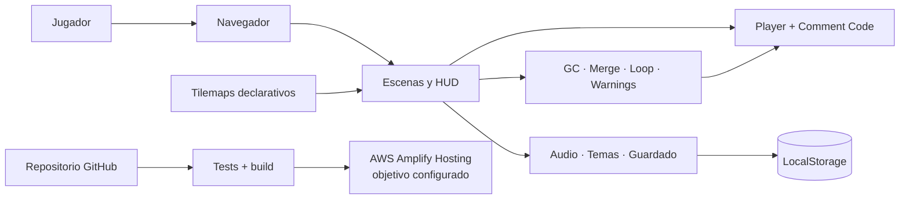

# Syntax Error

**Un plataformas 2D donde los errores de programación dejan de ser mensajes y se convierten en mecánicas.**

En **Syntax Error** controlas a un punto y coma (`;`) a través de cinco niveles inspirados en problemas reales del desarrollo de software. El Garbage Collector castiga la inactividad, un Merge Conflict altera los controles, un Stack Overflow repite tus movimientos y los warnings degradan progresivamente la respuesta del juego. Para sobrevivir, puedes usar **Comment Code** y convertirte temporalmente en `// ;`.

> Proyecto desarrollado para el **Hackathon Kiro AI — Powered by AWS**.

## Demo

La aplicación está preparada para despliegue estático mediante **AWS Amplify Hosting** (`amplify.yml`) y GitHub Pages (`.github/workflows/deploy.yml`). La URL pública debe añadirse aquí después de activar uno de los despliegues.

## Game design

Syntax Error adopta una filosofía *masocore justa*: sorprende al jugador, pero cada fallo debe ser legible, repetible y superable en el siguiente intento.

- **Curva progresiva:** cada nivel introduce una regla y el quinto combina las cuatro.
- **Reintento sin fricción:** vidas infinitas, checkpoints y respawn en aproximadamente 250 ms.
- **Control preciso:** salto variable, coyote time de 80 ms y jump buffer de 100 ms.
- **Decisión táctica:** Comment Code ofrece 0.5 s de inmunidad con 2 s de cooldown; no es una solución permanente.
- **Feedback multimodal:** HUD, señales visuales, mensajes y audio comunican estados relevantes.
- **Personalización:** cinco temas visuales y volumen independiente de música y efectos.

### Los cinco niveles

| Nivel | Error convertido en mecánica | Desafío |
| --- | --- | --- |
| 1. Garbage Collector | Recolección de objetos sin referencias | Permanecer inactivo durante 5 s provoca la eliminación del jugador. |
| 2. Merge Conflict | Conflictos de Git | Hay que resolver switches; una decisión incorrecta invierte los controles. |
| 3. Stack Overflow | Recursión descontrolada | El nivel repite los últimos 2 s, genera clones y termina en `RangeError`. |
| 4. Warning Fatigue | Deuda técnica ignorada | Cada warning añade latencia al input hasta un máximo definido. |
| 5. Production | Fallos que convergen en producción | Las cuatro mecánicas aparecen por separado y después se combinan. |

## Controles

| Acción | Teclas |
| --- | --- |
| Mover | `A` / `D` o flechas izquierda / derecha |
| Saltar | `Espacio`, `W` o flecha arriba |
| Comment Code | `Shift` o `C` |
| Pausa | `Escape` |
| Menús | Flechas o `W` / `S`; confirmar con `Enter` o `Espacio` |

## Arquitectura



El juego usa módulos ES, composición de componentes de KAPLAY y comunicación dirigida por eventos. Los niveles son datos declarativos que el `levelLoader` valida antes de crear entidades, lo que separa contenido, mecánicas y presentación.

## Desarrollo con Kiro

Kiro se utilizó como parte central del proceso *spec-driven*:

1. [Requisitos](.kiro/specs/syntax-error/requirements.md): historias de usuario, criterios EARS, restricciones y propiedades de correctitud.
2. [Diseño](.kiro/specs/syntax-error/design.md): arquitectura, interfaces, flujos y decisiones técnicas.
3. [Plan de implementación](.kiro/specs/syntax-error/tasks.md): trabajo incremental con trazabilidad hacia requisitos.
4. [Plan de equipo](.kiro/specs/syntax-error/plan-equipo.md): paralelización, dependencias, riesgos y definición de terminado.

Este flujo permitió convertir una idea de juego en componentes pequeños y verificables, mantener coherencia entre cinco mecánicas y validar tanto ejemplos concretos como invariantes generales.

## Stack

- JavaScript con ES Modules
- [KAPLAY](https://kaplayjs.com/) 3001
- Vite 8
- Web Audio API y LocalStorage
- Node Test Runner, Vitest y fast-check
- GitHub Actions
- AWS Amplify Hosting (build spec incluido; activación pendiente)

## Ejecutar localmente

Requisitos: Node.js 22 y npm.

```bash
git clone https://github.com/Osvxldx/Game-Padex.git
cd Game-Padex/syntax-error
npm ci
npm run dev
```

Vite sirve el juego en `http://localhost:3001`.

## Verificación

```bash
npm test          # unitarias y property-based
npm run build     # bundle de producción
npm run smoke     # recorrido real del bundle en Chrome mediante CDP
npm run package   # build + archivo release/syntax-error.zip
```

Última comprobación local, 27 de julio de 2026:

- **190 pruebas aprobadas:** 119 con Node Test Runner y 71 con Vitest.
- Build de producción correcto: **297.72 kB** de JavaScript antes de gzip y **100.61 kB** comprimido.
- Smoke test sin excepciones JavaScript.
- Carga medida: **741 ms**, por debajo del presupuesto de 3 s.
- Heap medido: **12.4 MB**, por debajo del presupuesto de 200 MB.
- Canvas verificado en 1280×720, 1920×1080 y 3840×2160.

El workflow [Build, verify and deploy](.github/workflows/deploy.yml) impide publicar si fallan tests, build, smoke o empaquetado.

## Estructura

```text
.
├── .kiro/specs/syntax-error/   # requisitos, diseño y tareas de Kiro
├── .github/workflows/          # CI y despliegue de GitHub Pages
├── docs/                       # investigación y materiales del hackathon
├── amplify.yml                 # build spec para AWS Amplify Hosting
└── syntax-error/
    ├── scripts/                # smoke test y empaquetado
    ├── src/
    │   ├── components/         # jugador, Comment Code y HUD
    │   ├── levels/             # cinco niveles declarativos
    │   ├── mechanics/          # las cuatro mecánicas principales
    │   ├── scenes/             # menú, juego, ajustes y pausa
    │   └── systems/            # audio, guardado, temas y respawn
    └── public/
```

## Despliegue con AWS Amplify Hosting

El archivo `amplify.yml` instala dependencias, ejecuta las 190 pruebas y genera `syntax-error/dist` antes de publicar. Para completar la integración hay que conectar este repositorio en AWS Amplify, seleccionar la rama final y definir `AMPLIFY_MONOREPO_APP_ROOT=syntax-error`. No se debe anunciar AWS como servicio activo hasta que la compilación termine y exista una URL pública verificable.

## Autor y licencia

Creado por **Osvaldo C. Zamora**. Distribuido bajo la [licencia MIT](LICENSE).
